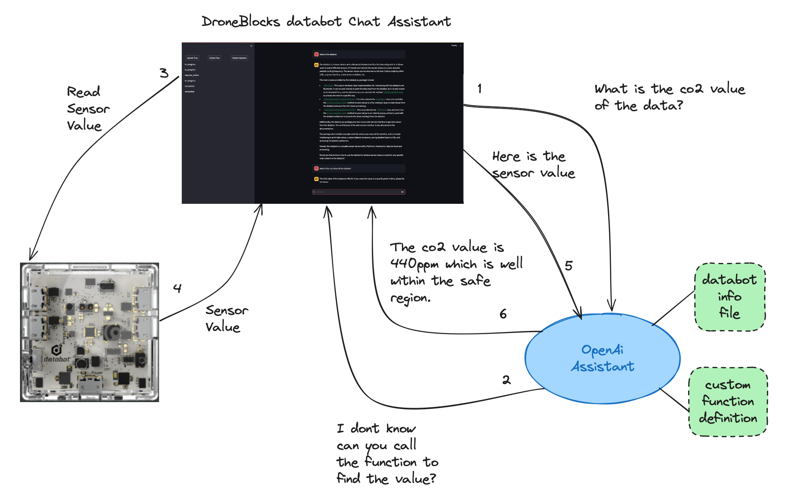
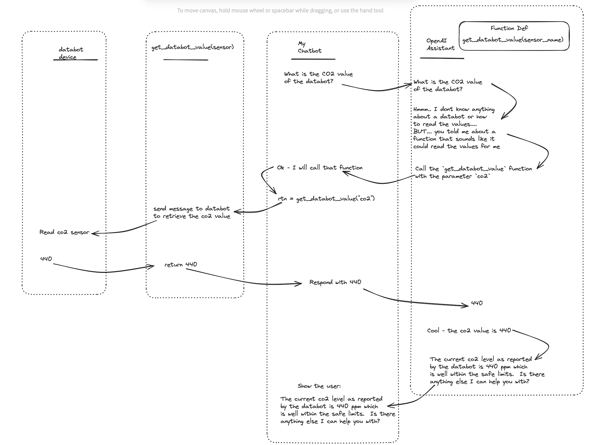

# DroneBlocks databot OpenAI Chat Assistant

An OpenAI Assistant to 'chat' with the databot device.

## Setup

## Create Python Virtual Env

Make sure you create a Python virtual environment and activiate the Python virtual Environment.

## Install

### Install Local Requirements

Recommended steps to install locally in a terminal window

Depending upon your Operating system and Python install, execute one of the following:
* `pip install pip-tools` or `python -m pip install pip-tools`

Then run:
* `pip-compile`
* `pip-sync`


## OpenAI API Key

It is assumed you have an OpenAI API Key, and you place that into a file called, .env at the root of the project.

The contents of the file should look like:

```text
OPENAI_API_KEY=sk-oeVK-your-api-key-here
```

## Jupyter Lab

To get an idea of how to use the OpenAIAssistant class to interact with OpenAI, use the `OpenAIAssistantOverview` python notebook.

Run: 

```shell
jupyter lab
```

Then open that notebook.


## Run

In one terminal:

```shell
streamlit run app.py
```
In another terminal
```shell
python pydatabot_webserver.py
```

In the left nav, select the 'Upload files' button.  At the moment the only uploads a single file about the DroneBlocks databot-py Python package.

Ask a question of the databot.  For example

* What is the current CO2 value from the databot?
* What is the VOC value?
* What does the voc sensor measure?
* Is the co2 level safe?
* What are the classes in the DroneBlocks databot-py python package?
* Can you provide an example python script to save databot values to a file?
* What sensor values are available to report on?
Assuming you have an external temperature probe
* what is the temp 1 value in fahrenheit

## Clean Up OpenAI

Before stopping the Chat application make sure to press the

`Delete Files` button and the `Delete Assistant` button.

## Architecture



## Message Flow


